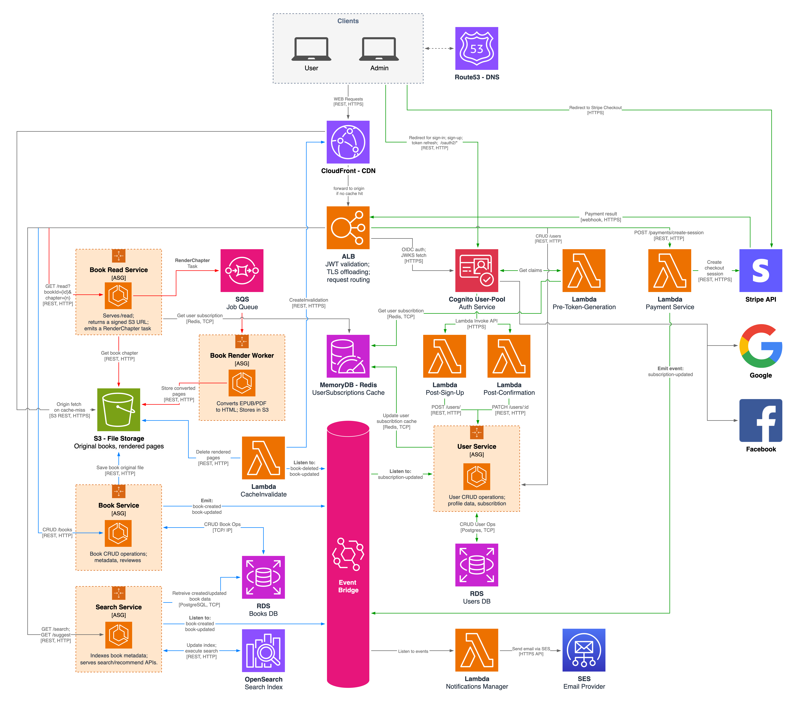

A web-based reading platform where administrators upload and manage books while readers browse, rate, and search the catalogue. Users can unlock online reading through a monthly subscription.
## Product Overview & Functional Requirements
- **Roles**
    - Administrators sign in with email + password.
    - Users sign up with email + password or Google / Facebook OAuth.
- **Administrator capabilities**
    - Upload, replace, and delete books in PDF, EPUB, or MOBI.
    - Edit all book metadata (title, author, genre, tags, description, cover).
- **User capabilities (no subscription required)**
    - Browse the full catalogue, filter by author/genre, and run full-text searches.
    - View average ratings and read individual reviews.
    - Leave 1-to-5-star ratings and short text reviews.
- **Subscription**
    - Single monthly recurring plan processed through Stripe Checkout.
    - Active subscribers can read any book online via the web reader.
- **Email notifications**
    - Both administrators and users receive email notifications for relevant events (e.g., account, content, and payment updates).

## Solution Design

The platform follows a micro-services + event-driven design: each bounded-context runs in its own service, all domain changes are published to Amazon EventBridge, and stateless components scale behind container Auto-Scaling Groups or Lambda functions. Edge caching (CloudFront) and origin routing (ALB) keep latency low while letting services evolve independently.

#### Client & Edge Layer
- **Clients** – two personas, User and Admin.
- **Route 53** – DNS for app.example.com.
- **CloudFront CDN** – caches HTML chapters, images and API GETs; Improves global latency and shields origins from spikes.
- **Application Load Balancer** – provides TLS off-loading, host/path routing, and JWT validation via the built-in authenticate-cognito action.

#### Authentication & User Management
- **Cognito User-Pool** provides email-and-password login plus Google / Facebook federation; two groups (“admin”, “user”) cover static roles.
- **Pre-Token-Generation Lambda** looks up the user’s current subscription tier in MemoryDB Redis and injects it as a custom claim before Cognito signs the JWT.
- **Post-Sign-Up Lambda** creates an initial “pending” profile row in User-service as soon as registration completes.
- **Post-Confirmation Lambda** flips that profile to “active” when the user verifies their email.
- **User-service** exposes profile CRUD; it owns two persistence layers:
    - **RDS Users** – the relational source of truth for profile data and subscription status.
    - **MemoryDB Redis** – a hot cache keyed by `subscription:{userId}` so BookRead can do a single sub-millisecond lookup.  Subscription updates in RDS automatically overwrite the Redis key, guaranteeing real-time revocation or upgrade.

#### Payments
A **Payment Lambda** handles both front-end checkout creation and Stripe webhooks:
1. Front-end calls `POST /payments/create-session`; the Lambda opens a Stripe Checkout Session and returns the redirect URL.
2. Stripe later calls on the `/payments/webhook` path; the function verifies the signature and publishes a `SubscriptionUpdated` event to EventBridge.

#### Book Domain
- **Book-service** — handles book CRUD, ratings, and reviews; writes original uploads to S3 and metadata to the relational store; publishes `BookCreated` / `BookUpdated`.  
- **BookRead-service** — verifies the user’s JWT, checks Redis entitlement, returns a signed CloudFront URL, and—if the chapter isn’t ready—drops a job on SQS.
- **Render-Worker** — consumes the SQS queue, converts PDF/EPUB pages to HTML, writes rendered slices to S3;
- **CacheInvalidation Lambda** — listens for `BookUpdated` events, deletes the corresponding rendered objects in the derived-pages S3 bucket, and then calls CloudFront `CreateInvalidation` to flush any cached copies of those chapters
- **S3 (originals bucket)** — immutable storage for uploaded PDFs / EPUBs / MOBIs.
- **S3 (derived bucket)** — holds pre-rendered HTML slices that CloudFront serves directly.
- **SQS `render-jobs` queue** — at-least-once work queue for chapter-render tasks.
- **RDS Books** — relational source of truth for book metadata, ratings, and reviews.

#### Search
- **Search-service** — consumes `BookCreated/Updated` events, indexes metadata, and serves `/search` and `/recommend` APIs.
- **OpenSearch cluster** — holds the full-text index that powers search and recommendation queries.

#### Notifications
- A lightweight **Notifications Manager Lambda** listens on EventBridge (new reviews, payment success/failure, rendering errors) and sends templated emails through **Amazon SES**, ensuring both admins and users are informed of important events.

#### Architecture Highlights
- **Stateless autoscaling** – Book, Search, BookRead, and Render-Worker each run in an Auto-Scaling Group across multiple AZs.
- **Lambdas** handle bursty, low-duty workloads (auth triggers, payments, cache invalidation, notifications) at zero idle cost.
- **Cache-then-DB** pattern keeps page-turn latency low and database load predictable.
- **EventBridge + SQS separation** cleanly distinguishes immutable business events from retry-able work items.

## User Flows
### User registration + subscription purchase
### Administrator adds a new book

### User reads a book chapter
