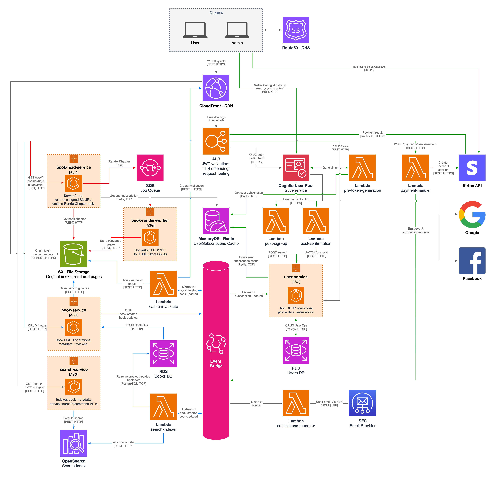
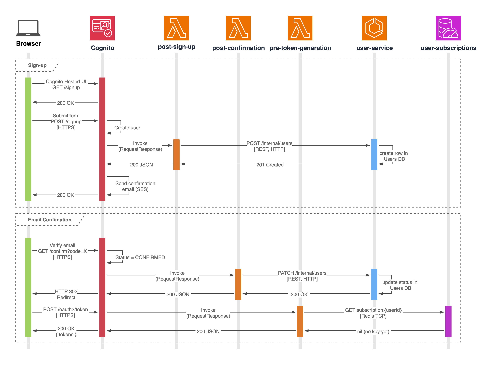

# Book Reader System Design
A web-based reading platform where administrators upload and manage books while readers browse, rate, and search the catalogue. Users can unlock online reading through a monthly subscription.
## Product Overview & Functional Requirements
- **Roles**
    - Administrators sign in with email + password.
    - Users sign up with email + password or Google / Facebook OAuth.
- **Administrator capabilities**
    - Upload, replace, and delete books in PDF, EPUB, or MOBI.
    - Edit all book metadata (title, author, genre, tags, description, cover).
- **User capabilities (no subscription required)**
    - Browse the full catalogue, filter by author/genre, and run full-text searches.
    - View average ratings and read individual reviews.
    - Leave 1-to-5-star ratings and short text reviews.
- **Subscription**
    - Single monthly recurring plan processed through Stripe Checkout.
    - Active subscribers can read any book online via the web reader.
- **Email notifications**
    - Both administrators and users receive email notifications for relevant events (e.g., account, content, and payment updates).

## Solution Design
The platform follows a micro-services + event-driven design: each bounded-context runs in its own service, all domain changes are published to Amazon EventBridge, and stateless components scale behind container Auto-Scaling Groups or Lambda functions. Edge caching (CloudFront) and origin routing (ALB) keep latency low while letting services evolve independently.

#### Client & Edge Layer
- **Clients** – two personas, User and Admin.
- **Route 53** – DNS for app.bookreader.com.
- **CloudFront CDN** – caches HTML chapters, images and API GETs; Improves global latency and shields origins from spikes.
- **Application Load Balancer** – provides TLS off-loading, host/path routing, and JWT validation via the built-in authenticate-cognito action.

#### Authentication & User Management
- **Cognito User-Pool** provides email-and-password login plus Google / Facebook federation; two groups (“admin”, “user”) cover static roles.
- **Pre-Token-Generation Lambda** looks up the user’s current subscription tier in MemoryDB Redis and injects it as a custom claim before Cognito signs the JWT.
- **Post-Sign-Up Lambda** creates an initial “pending” profile row in User-service as soon as registration completes.
- **Post-Confirmation Lambda** flips that profile to “active” when the user verifies their email.
- **User-service** exposes profile CRUD; it owns two persistence layers:
    - **RDS Users** – the relational source of truth for profile data and subscription status.
    - **MemoryDB Redis** – a hot cache keyed by `subscription:{userId}` so BookRead can do a single sub-millisecond lookup.  Subscription updates in RDS automatically overwrite the Redis key, guaranteeing real-time revocation or upgrade.

#### Payments
A **Payment Lambda** handles both front-end checkout creation and Stripe webhooks:
1. Front-end calls `POST /payments/create-session`; the Lambda opens a Stripe Checkout Session and returns the redirect URL.
2. Stripe later calls on the `/payments/webhook` path; the function verifies the signature and publishes a `SubscriptionUpdated` event to EventBridge.

#### Book Domain
- **Book-service** — handles book CRUD, ratings, and reviews; writes original uploads to S3 and metadata to the relational store; publishes `BookCreated` / `BookUpdated`.  
- **BookRead-service** — verifies the user’s JWT, checks Redis entitlement, returns a signed CloudFront URL, and—if the chapter isn’t ready—drops a job on SQS.
- **Render-Worker** — consumes the SQS queue, converts PDF/EPUB pages to HTML, writes rendered slices to S3;
- **CacheInvalidation Lambda** — listens for `BookUpdated` events, deletes the corresponding rendered objects in the derived-pages S3 bucket, and then calls CloudFront `CreateInvalidation` to flush any cached copies of those chapters
- **S3 (originals bucket)** — immutable storage for uploaded PDFs / EPUBs / MOBIs.
- **S3 (derived bucket)** — holds pre-rendered HTML slices that CloudFront serves directly.
- **SQS `render-jobs` queue** — at-least-once work queue for chapter-render tasks.
- **RDS Books** — relational source of truth for book metadata, ratings, and reviews.

#### Search
- **Search-service** — consumes `BookCreated/Updated` events, indexes metadata, and serves `/search` and `/recommend` APIs.
- **OpenSearch cluster** — holds the full-text index that powers search and recommendation queries.

#### Notifications
- A lightweight **Notifications Manager Lambda** listens on EventBridge (new reviews, payment success/failure, rendering errors) and sends templated emails through **Amazon SES**, ensuring both admins and users are informed of important events.

#### Architecture Highlights
- **Stateless autoscaling** – Book, Search, BookRead, and Render-Worker each run in an Auto-Scaling Group across multiple AZs.
- **Lambdas** handle bursty, low-duty workloads (auth triggers, payments, cache invalidation, notifications) at zero idle cost.
- **Cache-then-DB** pattern keeps page-turn latency low and database load predictable.
- **EventBridge + SQS separation** cleanly distinguishes immutable business events from retry-able work items.

## User Flows
### User registration
The sign-up flow relies on Amazon Cognito’s Hosted UI for all user-facing auth, while three lightweight AWS Lambdas (Post-Sign-Up, Post-Confirmation, Pre-Token-Generation) integrate Cognito with our own User-service and Redis cache. This keeps passwords and e-mail verification fully managed by AWS, yet injects subscription status into every JWT without adding latency to the core APIs.

1. **User opens the sign-up page**
   Their browser loads Cognito’s Hosted-UI (`GET /signup` over HTTPS) and receives the HTML form.
2. **User submits the registration form**
   The browser posts back to Cognito (`POST /signup`).
   Cognito creates an **UNCONFIRMED** user record, then **invokes the Post-Sign-Up Lambda synchronously**.
3. **Post-Sign-Up Lambda seeds your profile store**
   It calls `POST /internal/users` on the User-service (REST, HTTPS).
   The User-service inserts a “pending” row in **RDS Users** and returns `201 Created`.
   Lambda’s 200-JSON response signals Cognito everything succeeded.
4. **Cognito sends the verification e-mail**
   Using SES under the hood, Cognito dispatches the confirmation message, then returns `200 OK` to the browser.
5. **User clicks the link in the e-mail**
   The browser hits `GET /confirm?code=...` on Cognito.
   Cognito marks the account **CONFIRMED** and synchronously calls the **Post-Confirmation Lambda**.
6. **Post-Confirmation Lambda activates the profile**
   It patches the same user row via `PATCH /internal/users/{id}`; the User-service updates status to *active* in RDS and returns `200 OK`.
   Lambda responds 200-JSON to Cognito.
7. **Cognito redirects the browser back to your app**
   A 302 Location header points at `https://app.bookreader.com/callback?code=AUTH_CODE&state=…`.
8. **Browser exchanges the auth-code for tokens**
   `POST /oauth2/token` to Cognito (HTTPS).
   During token issuance Cognito invokes the **Pre-Token-Generation Lambda**.
9. **Pre-Token Lambda fetches the subscription tier**
   It issues `GET subscription:{userId}` to **MemoryDB Redis** (TCP 6379).
   Because the new user hasn’t paid yet, Redis returns *nil*; the Lambda injects no tier claim and returns 200.
10. **Cognito hands tokens to the browser**
    `200 OK` with `id_token`, `access_token`, `refresh_token`.
    The user is now logged in; subsequent API calls carry the access token and pass through the ALB’s JWT validation.

### Administrator adds a new book
The upload flow creates a new book record in the main database, streams the source file to S3 via a pre-signed URL, and triggers asynchronous search indexing.

1. **Admin requests an upload URL**
   The browser calls `POST /books/presign` on Book-service (HTTPS).
   Book-service inserts a stub row in RDS Books with status `uploading`, generates a pre-signed S3 PUT URL, and returns **200 OK** containing `{ bookId, uploadUrl }`.
2. **Admin uploads the file to S3**
   The browser uploads the book file with a `PUT` request to the pre-signed S3 URL.
   Amazon S3 stores the object and replies **200 OK**.
3. **Admin finalises metadata**
   The browser sends `POST /books/{bookId}` with title, author, genre, and other details to Book-service.
   Book-service updates the existing row in RDS Books to status `active`, writes full metadata, then emits a `BookCreated` event to EventBridge.
   After both the database update and the `PutEvents` call succeed, Book-service responds **201 Created** to the browser.
4. **Indexing happens asynchronously**
   EventBridge delivers the `BookCreated` event to the Search-indexer Lambda.
   The Lambda fetches the book’s metadata from RDS Books, writes a new document into OpenSearch, and exits.
### User reads a book chapter
