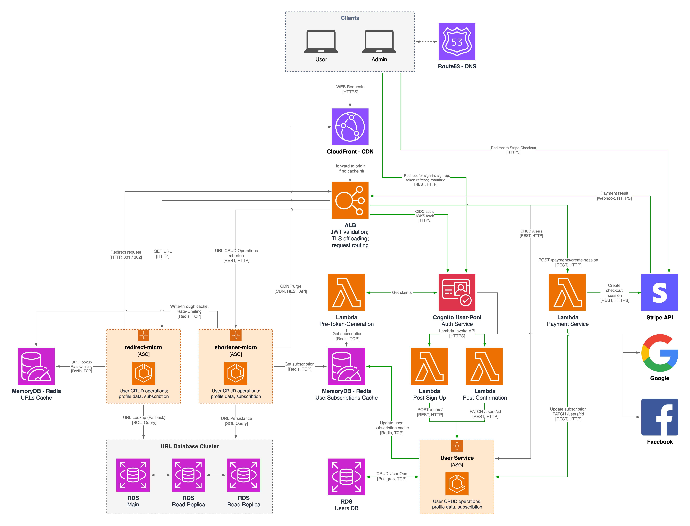

# URL Shortener System Design
The URL-Shortener Service turns long, unwieldy links into compact aliases that are fast to share, easy to remember, and safe to follow. It exposes a simple HTTPS API and a lightweight web UI, supports both free-tier and subscription plans, and gives administrators the controls they need to curb abuse and keep the code-space healthy.
## Product Overview & Functional Requirements
- **Actors**
    - **User** – any authenticated person or application creating and managing short links.
    - **Administrator** – ops or trust-&-safety staff with elevated privileges.
- **Core capabilities**
    - Generate a unique short URL for any valid HTTP/HTTPS target.
    - Resolve a short code to its original URL and issue an HTTP 301/302 redirect.
- **Plans & quotas**
    - *Free tier*: up to **1 000 active links** per account, **20 creates / hour**.
    - *Subscription tier*: quotas configurable at runtime (e.g., 100 000 active links, 1 000 creates / hour).
- **Lifecycle & management**
    - Users can view, disable, or delete their own links.
    - System automatically flags and soft-deletes links with **>12 months of inactivity**; hard deletion executes after a configurable grace period.
    - Administrators can force-delete or block any link or user account at any time.
- **Abuse prevention**
    - Per-user and per-IP **rate-limiting** on create requests.
    - Per-code and per-IP throttles on redirects to dampen DDoS spikes.
    - Malware / phishing scanning hook on every new target URL.

## Solution Design
